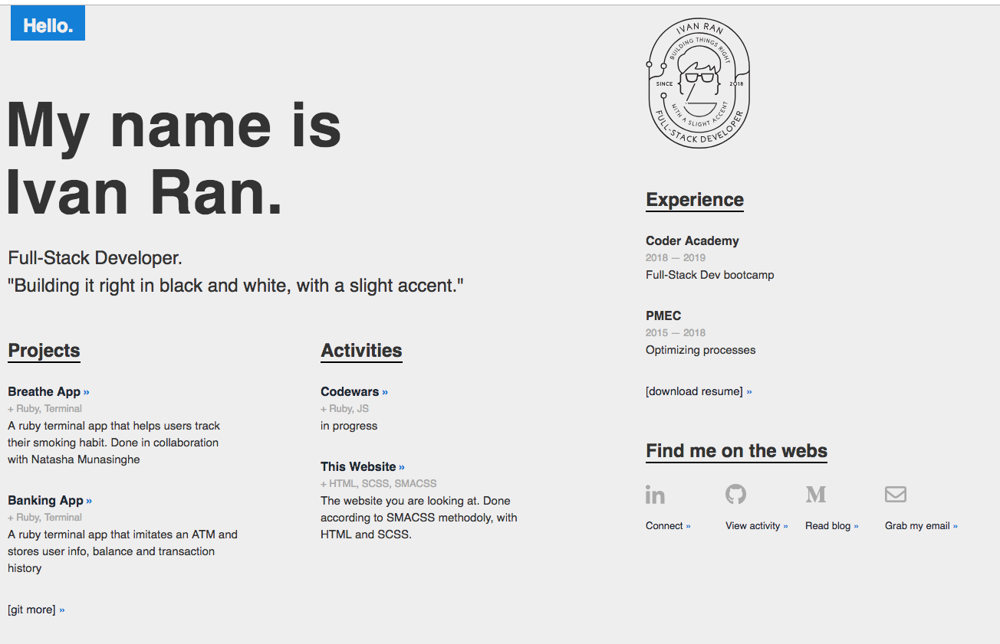
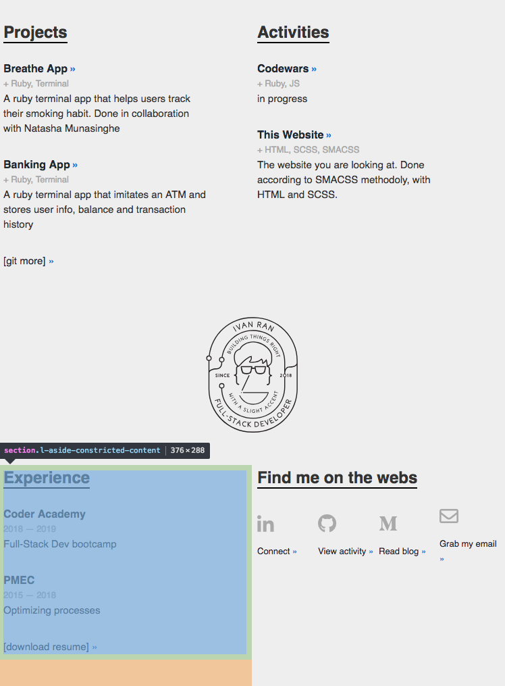
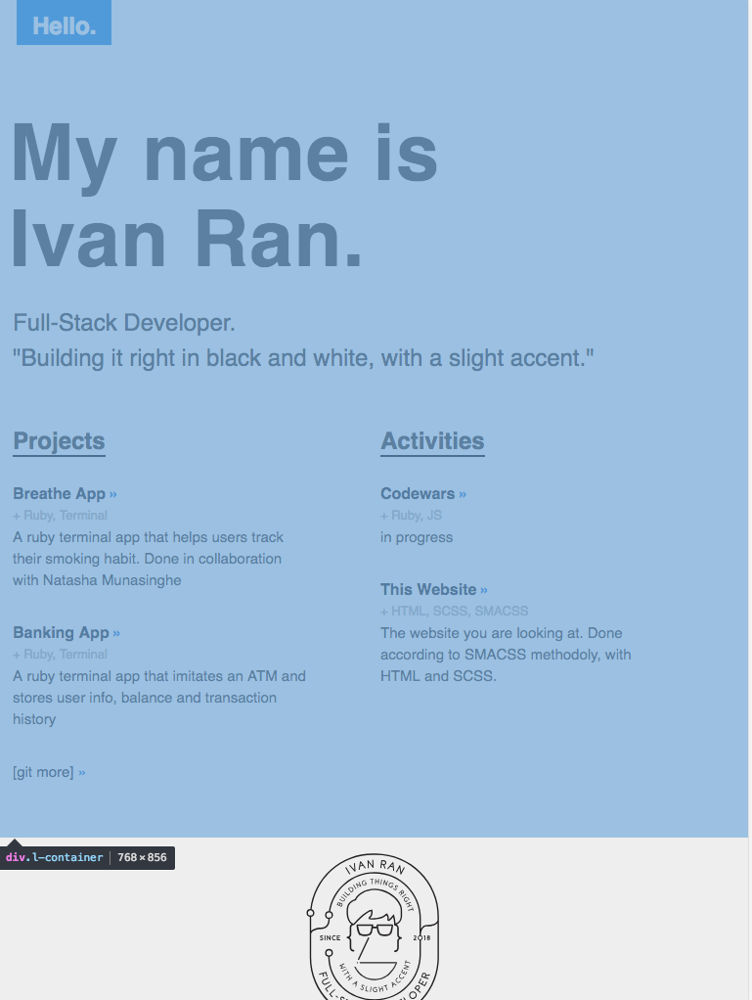
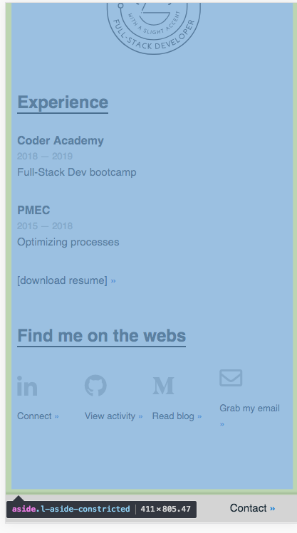
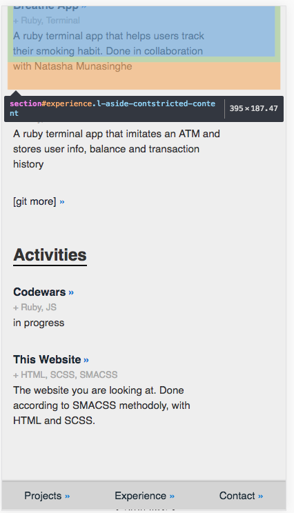
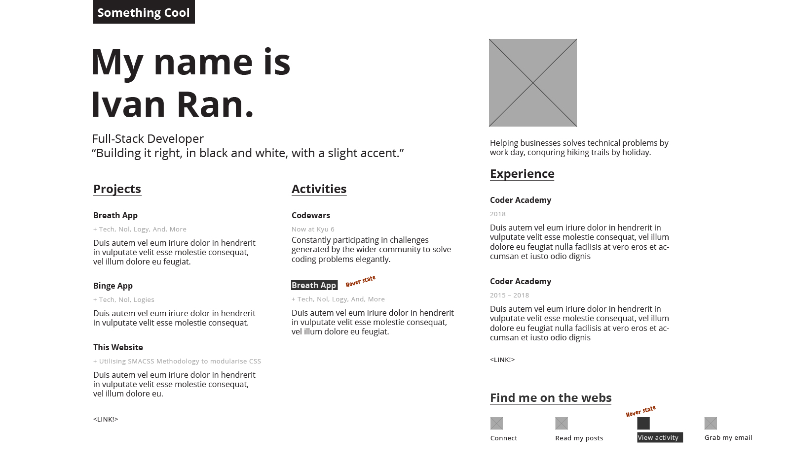
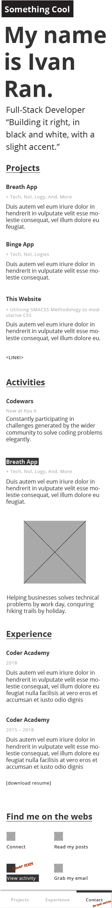
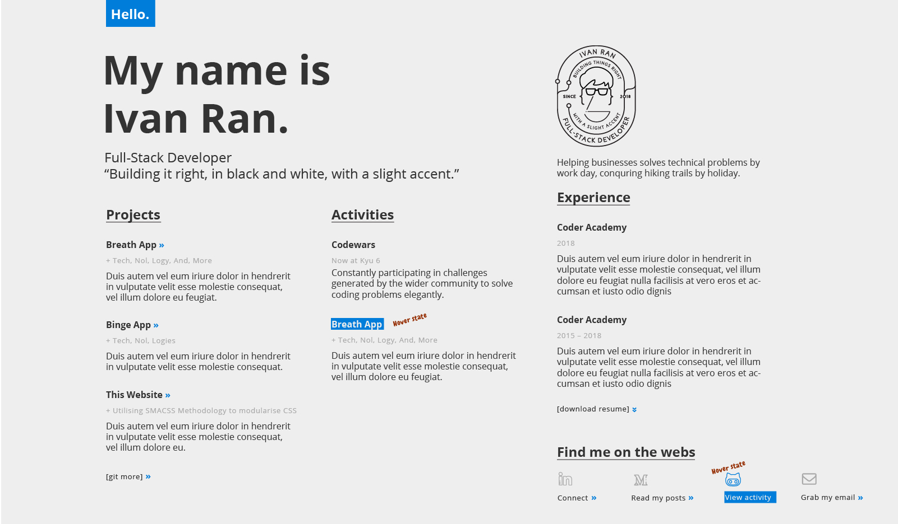
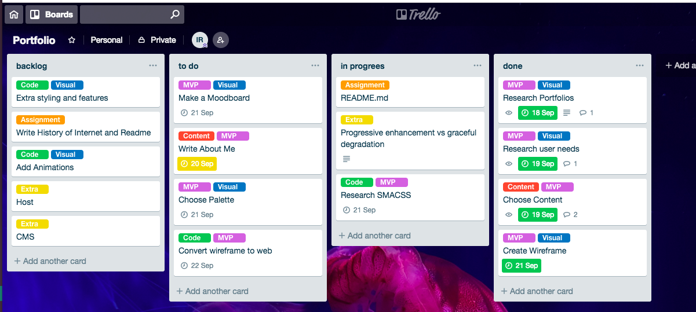
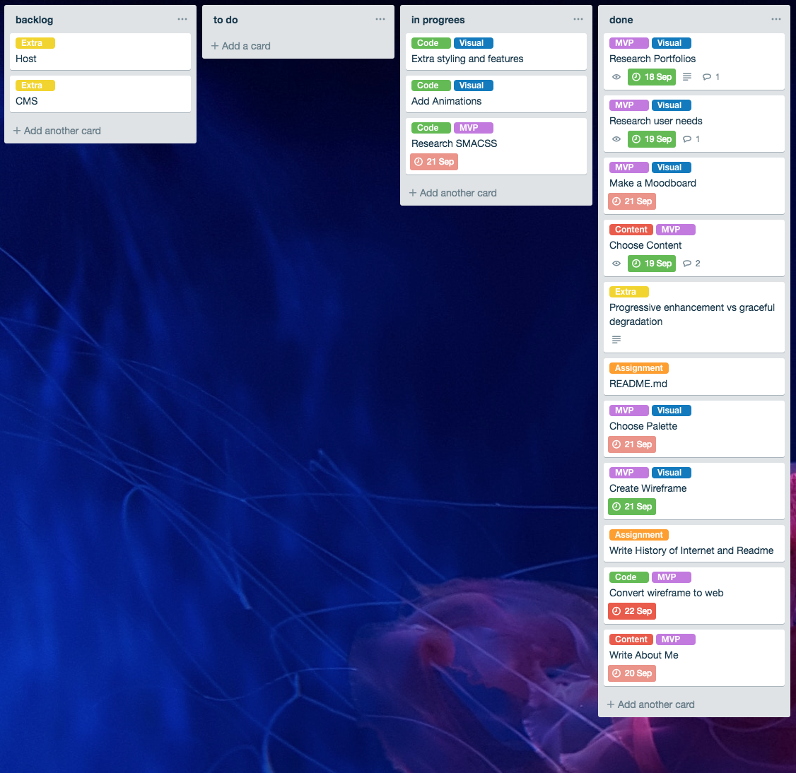

# Portfolio Website

#### URL link: https://ivanrahn.github.io/portfolio/

#### Github link: https://github.com/IvanRahn/portfolio

This website is a portfolio I created for myself.
The website is not very complicated but has a nice clean look.

Features: animations, copy to clipboard for email links, mobile navbar.
During the development of the website I took into consideration SMACSS methodology and graceful degradation mindset.

#### Sitemap:
The website consist of 4 sections: Header, Projects, Activities and Experience.
On desktop the sections are in direct view upon opening the page.
The navbar appears when viewed on mobile and the sections are accessible either though navbar or by scrolling.

#### Screenshots:

### Target audience:
The target audience is senior developers, CTOs and recruiters.
### Design process
User needs were taken into the consideration during the design process. After conducting an informal survey the user needs could be categorized as follow:
1. Ease of access to projects and Github
2. Sign of open source contribution or any other involvement in the community
3. Cultural fit
4. Attention to detail
5. Showcase personality

I also took into consideration the user journey:
1. The user would access my portfolio through a link from one of my social media accounts, my resume or business card or through google.
2. The user should be able to see that he/she is on the correct page
3. The user should be able to easily browse my activities, projects and Experience
4. The user should see a call to action
5. After checking the information on the website the user should be able to easily contact me through social media or email.

### Wireframes and designs

### Personal logo

### Trello

### Brief History of Internet

The invention of the network and packet switching in mid 20th century and the formalization of TCP/IP protocol in 1982 were the foundation of the internet as we know it.
The global adoption of TCP/IP began with CERN in Europe in 1984.
The first Asian country to set up TCP/IP network was South Korea. And Australia adopted the protocols and formed a IP based network called AARNet in 1989.
First Web server was created by Tim Bernes-Lee in 1989, as well as the first web browser, known as WorldWideWeb and later as Nexus.
Marc Andreessen created a web browser known as Mosaic (he also created Netscape Navigator). Mosaic was the first browser that was able to display media along with text, which is one of the reasons the Internet started getting traction during that time.

### Relationship between fundamental aspects of the internet such as: domains, web servers, DNS, and web browsers

Internet is a world wide web of connected devices. Each devise on the internet has a unique mac address which it can be identified by.
When a device is connected to internet it has to use an IP address, which looks like 4 numbers from 0-255 separated by a dot.
When exchanging information over internet computers use a protocol called TCP/IP.
DNS stand for Domain Name Service and is a database of IP addresses.
Browsers use DNS to retrieve the IP addresses of the pages we are looking for.
Once the browser receives the IP address it connects to the web server and sends a request for the page. If the page exists the browser receives information and checks the received data. If it needs additional information it will connect to the server again. Once all the information is received the page loading is finished.

### Impact of Internet and it's contribution to the world today

Internet plays a major part in the modern world. Most of the communication nowadays is done through the internet.
One of the reasons the technology was able to advance so rapidly in the last 50 years could be attributed to the internet. Historically many discoveries were made independently by different individuals or groups of people. The information used to be hard to access because it was stored locally on paper, or the person who had insights in the technological field was difficult to communicate to because that person could have been living in a different country. With the invention of internet, scientific collaboration has become a lot more available to everybody. Most of the information is very easy to access from any location due to it being stored digitally and distributed over internet. It is also easy for scientists to contact each other over internet.
